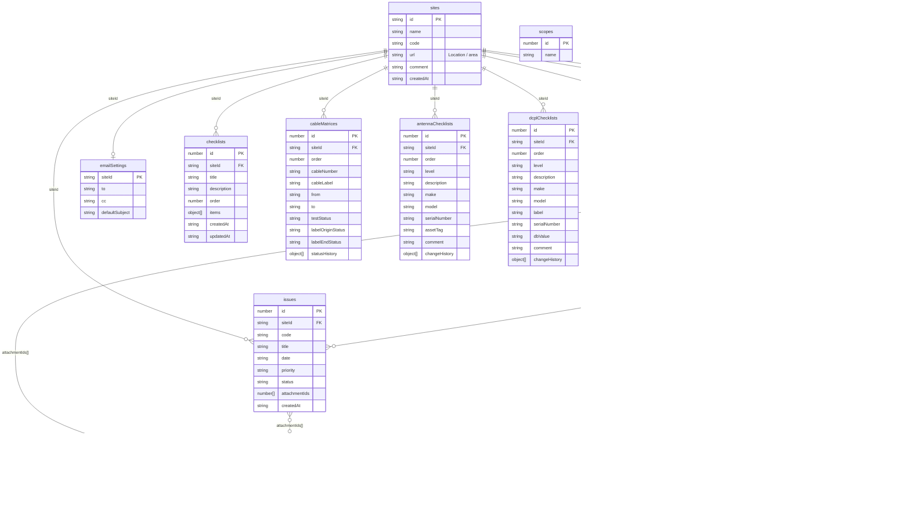

# Database Reference

This app is client-only. All persistent data is stored in browser IndexedDB through Dexie.

## Database

- Name: `qa-tracker`
- Library: `Dexie`
- Current schema version: `11`
- Source: [src/db/index.js](C:\Users\Hengty(Jack)Eang\OneDrive - SkyAus Infrastructure Pty Ltd\Desktop\Self Induction\Claude app\QA daily work\qa-tracker\src\db\index.js)

## Entity Diagram

Notes:
- `reports`, `issues`, and `confirms` use array references to `attachments` rather than join tables.
- `reports` also keep array references to linked blockers and linked confirmations.
- `checklists.items`, `cableMatrices.statusHistory`, and the asset-board `changeHistory` arrays are embedded inside parent records, not separate tables.
- `scopes`, `activityLog`, and `confirmSources` are support tables and do not currently have hard foreign-key links in IndexedDB.

## Schema History

- `v1` introduced `sites`, `reports`, `issues`, `confirms`, `attachments`, `emailSettings`
- `v4` added `scopes`
- `v5` added `activityLog`
- `v6` added `confirmSources`
- `v7` added `checklists`
- `v8` added `cableMatrices`
- `v9` added `antennaChecklists`
- `v10` added `dcplChecklists`
- `v11` added `cableChecklists`

## Current Tables

### `sites`

Primary key:
- `id` string slug

Common fields:
- `id`
- `name`
- `code`
- `url`
  user-facing meaning: `Location / area`
- `comment`
- `createdAt`

Notes:
- site records are created in [useSites.js](C:\Users\Hengty(Jack)Eang\OneDrive - SkyAus Infrastructure Pty Ltd\Desktop\Self Induction\Claude app\QA daily work\qa-tracker\src\composables\useSites.js)
- deleting a site also deletes related `reports`, `issues`, `confirms`, `checklists`, `cableMatrices`, `antennaChecklists`, `dcplChecklists`, `cableChecklists`, and `emailSettings`

### `reports`

Primary key:
- `id` auto-increment number

Indexed fields:
- `siteId`
- `date`

Common fields:
- `id`
- `siteId`
- `date`
- `time`
- `notes`
- `attachmentIds`
- `linkedIssueIds`
- `linkedConfirmIds`
- `createdAt`

Notes:
- internal name is `reports`, user-facing meaning is progress updates

### `issues`

Primary key:
- `id` auto-increment number

Indexed fields:
- `siteId`
- `status`

Common fields:
- `id`
- `siteId`
- `code`
  generated as `I-###` per site
- `title`
- `date`
- `priority`
- `status`
  commonly `open` or closed/resolved values from the UI
- `attachmentIds`
- `createdAt`

Notes:
- internal name is `issues`, user-facing meaning is blockers / risks

### `confirms`

Primary key:
- `id` auto-increment number

Indexed fields:
- `siteId`

Common fields:
- `id`
- `siteId`
- `code`
  generated as `C-###` per site
- `title`
- `date`
- `confirmedBy`
- `attachmentIds`
- `createdAt`

Notes:
- internal name is `confirms`, user-facing meaning is approvals / sign-offs

### `attachments`

Primary key:
- `id` auto-increment number

Common fields:
- `id`
- `blob`
  stored directly in IndexedDB
- `name`
- `size`
- `type`
- `createdAt`

Notes:
- attachments are referenced by ID arrays from reports, issues, and confirms

### `emailSettings`

Primary key:
- `siteId`

Fields:
- `siteId`
- `to`
- `cc`
- `defaultSubject`

Notes:
- one row per site when saved
- default fallback when no row exists:
  - `to: ''`
  - `cc: ''`
  - `defaultSubject: ''`

### `scopes`

Primary key:
- `id` auto-increment number

Fields:
- `id`
- `name`

Notes:
- schema upgrade seeds `Macro` when the table is first introduced and empty

### `activityLog`

Primary key:
- `id` auto-increment number

Fields:
- `id`
- `action`
- `detail`
- `at`

Notes:
- app reads latest 200 entries in reverse order

### `confirmSources`

Primary key:
- `id` auto-increment number

Fields:
- `id`
- `name`

Notes:
- schema upgrade seeds:
  - `Email`
  - `Slack`
  - `Meeting`

### `checklists`

Primary key:
- `id` auto-increment number

Indexed fields:
- `siteId`
- `order`

Record fields:
- `id`
- `siteId`
- `title`
- `description`
- `order`
- `items`
- `createdAt`
- `updatedAt`

`items` array shape:
- `id`
  local generated item ID, not a separate table row
- `title`
- `status`
  one of:
  - `todo`
  - `done`
  - `na`
- `comment`
- `statusHistory`

Checklist item `statusHistory` entry shape:
- `id`
- `fromStatus`
- `toStatus`
- `changedAt`

Notes:
- one record represents one main checklist
- sub checklist rows live inside the parent record's `items` array

### `cableMatrices`

Primary key:
- `id` auto-increment number

Indexed fields:
- `siteId`
- `order`

Record fields:
- `id`
- `siteId`
- `order`
- `cableNumber`
- `cableLabel`
  user-facing meaning: `Cable label at origin end destination`
- `from`
- `to`
- `testStatus`
- `labelOriginStatus`
- `labelEndStatus`
- `statusHistory`
- `createdAt`
- `updatedAt`

Status values:
- `no`
- `ok`

`statusHistory` entry shapes:

Status change entry:
- `id`
- `type`
  value: `status`
- `field`
  one of:
  - `testStatus`
  - `labelOriginStatus`
  - `labelEndStatus`
- `fromStatus`
- `toStatus`
- `changedAt`

Field change entry:
- `id`
- `type`
  value: `field`
- `field`
  one of:
  - `from`
  - `to`
- `fromValue`
- `toValue`
- `changedAt`

Notes:
- one record represents one cable matrix row
- row order is persisted for drag reorder

### `antennaChecklists`

Primary key:
- `id` auto-increment number

Indexed fields:
- `siteId`
- `order`

Record fields:
- `id`
- `siteId`
- `order`
- `level`
- `description`
- `make`
- `model`
- `serialNumber`
- `assetTag`
- `comment`
- `changeHistory`
- `createdAt`
- `updatedAt`

Notes:
- one record represents one antenna asset row
- row order is persisted for drag reorder

### `dcplChecklists`

Primary key:
- `id` auto-increment number

Indexed fields:
- `siteId`
- `order`

Record fields:
- `id`
- `siteId`
- `order`
- `level`
- `description`
- `make`
- `model`
- `label`
- `serialNumber`
- `dbValue`
- `comment`
- `changeHistory`
- `createdAt`
- `updatedAt`

Notes:
- one record represents one DCPL asset row
- row order is persisted for drag reorder

### `cableChecklists`

Primary key:
- `id` auto-increment number

Indexed fields:
- `siteId`
- `order`

Record fields:
- `id`
- `siteId`
- `order`
- `level`
- `cableLabel`
- `cableId`
- `hopCriteria`
- `sweepTestReceived`
- `remark`
- `cableLength`
- `changeHistory`
- `createdAt`
- `updatedAt`

Notes:
- one record represents one cable checklist row
- row order is persisted for drag reorder
- `sweepTestReceived` is stored as a date-like string in `YYYY-MM-DD` form when normalized by the app

## Backup / Import Coverage

The following tables are included in full backup/export flows:
- `sites`
- `reports`
- `issues`
- `confirms`
- `emailSettings`
- `attachments`
- `checklists`
- `cableMatrices`
- `antennaChecklists`
- `dcplChecklists`
- `cableChecklists`

Site-level export/import also includes:
- the selected site record
- all related reports, issues, confirms, attachments, checklists, cable matrix rows, antenna checklist rows, DCPL checklist rows, and cable checklist rows

Source:
- [src/lib/backup.js](C:\Users\Hengty(Jack)Eang\OneDrive - SkyAus Infrastructure Pty Ltd\Desktop\Self Induction\Claude app\QA daily work\qa-tracker\src\lib\backup.js)

## Data Lifecycle Notes

- The app starts empty and should not seed demo operational data.
- `initDb()` only removes the legacy untouched 8-site demo seed if it is detected exactly.
- Because storage is IndexedDB, data is scoped to the browser origin.
- Deploying to a different origin will not carry over old IndexedDB automatically.
