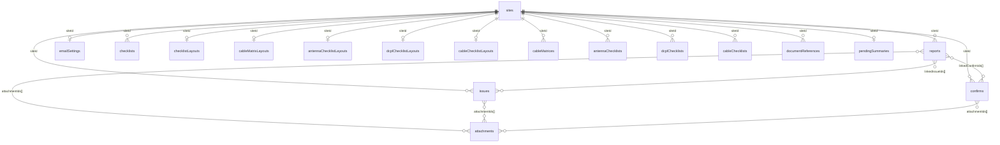
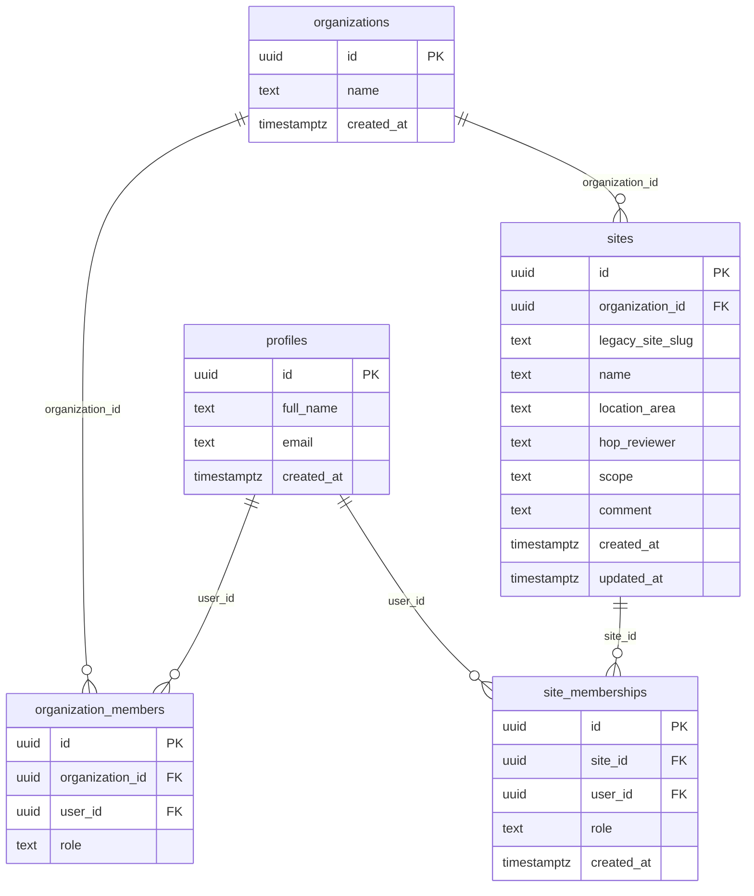
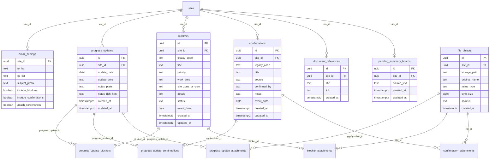
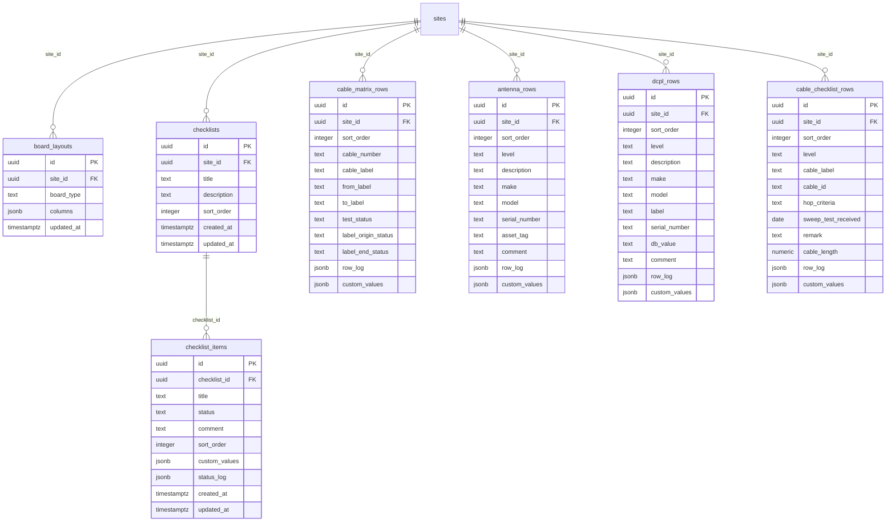
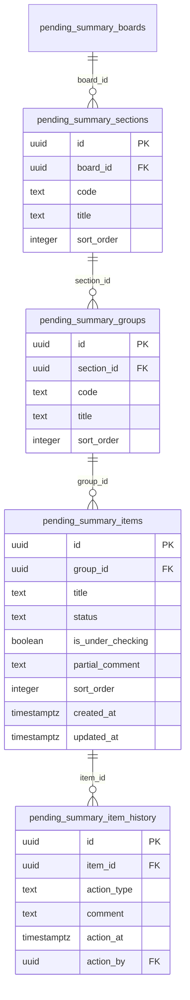
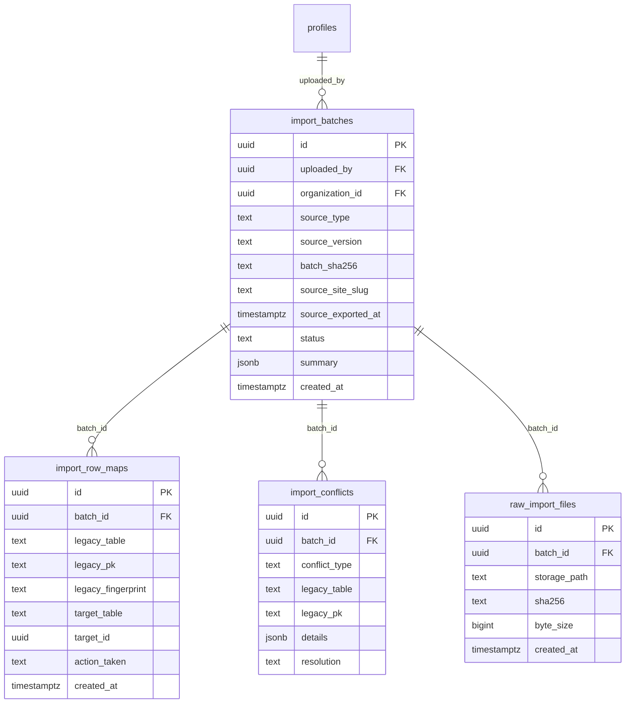

# Supabase Migration Plan

This document maps the current IndexedDB model to a Supabase-friendly design and lays out a safe migration path for existing JSON export files.

Current app facts from the live code:

- IndexedDB database name: `qa-tracker`
- Dexie schema version: `19`
- Site export payload version: `_version: 2`
- Current source files: [src/db/index.js](C:\Users\Hengty(Jack)Eang\OneDrive - SkyAus Infrastructure Pty Ltd\Desktop\Self Induction\Claude app\QA daily work\qa-tracker\src\db\index.js) and [src/lib/backup.js](C:\Users\Hengty(Jack)Eang\OneDrive - SkyAus Infrastructure Pty Ltd\Desktop\Self Induction\Claude app\QA daily work\qa-tracker\src\lib\backup.js)

## Goals

1. Move from local-only IndexedDB to Supabase without losing existing site exports.
2. Support real users, site owners, and row-level security.
3. Prevent duplicate imports when the same JSON file is uploaded twice or by different users.
4. Preserve traceability from legacy IndexedDB records to new Postgres rows.

## 1. Current IndexedDB Model

The current app is mostly site-scoped. Some relationships are stored as arrays inside records instead of join tables.

### Current table inventory

- `sites`
- `reports`
- `issues`
- `confirms`
- `attachments`
- `emailSettings`
- `scopes`
- `activityLog`
- `confirmSources`
- `checklists`
- `checklistLayouts`
- `cableMatrixLayouts`
- `antennaChecklistLayouts`
- `dcplChecklistLayouts`
- `cableChecklistLayouts`
- `cableMatrices`
- `antennaChecklists`
- `dcplChecklists`
- `cableChecklists`
- `documentReferences`
- `pendingSummaries`

### Important current-model migration notes

- `sites.id` is a browser-era slug string, not a globally safe cloud primary key.
- `attachments` store blobs directly in IndexedDB.
- `reports`, `issues`, and `confirms` reference attachments by `attachmentIds[]`.
- `reports` also reference blockers and confirmations by `linkedIssueIds[]` and `linkedConfirmIds[]`.
- `checklists.items` is embedded JSON inside the parent checklist row.
- `pendingSummaries` stores one board per site with nested sections, groups, items, and item history.

## 2. Recommended Supabase Target Model

### Design principles

- Use `uuid` primary keys for all cloud tables.
- Keep the legacy site slug as a normal column, not as the new primary key.
- Scope uniqueness by tenant or account, not globally.
- Replace array-based links with relational join tables.
- Move file blobs to Supabase Storage and keep metadata in Postgres.
- Keep an import ledger so migration is idempotent.

### Tenancy and access

If different site owners or customer groups may have the same site slug, add tenant scoping now. That avoids future collisions and makes RLS much cleaner.

Recommended uniqueness:

- `organizations.name` only if your business rules require it.
- `unique (organization_id, legacy_site_slug)` on `sites`.
- `unique (site_id, user_id)` on `site_memberships`.
- Optional: unique partial index on `site_memberships(site_id)` where `role = 'owner'` if exactly one owner is allowed.

### Core site data

### Field boards and customizable layouts

This keeps board rows relational, but lets dynamic columns stay flexible.

### Pending summary detail

Because this board has nested status updates and history, normalize it if multiple users will edit the same site.

## 3. Migration and Import Ledger

This is the part that prevents duplicate migration.

## 4. Best Practices for Your Migration

### A. Do not use the old IndexedDB IDs as global cloud IDs

Current `reports.id`, `issues.id`, `confirms.id`, and attachment IDs are only unique inside a single local browser database. In Supabase:

- create new `uuid` primary keys
- keep legacy IDs in migration metadata
- never trust local numeric IDs as cross-user unique identifiers

### B. Treat the current site slug as a business key, not the primary key

Current `sites.id` is useful, but in a multi-user system it can collide. Best practice:

- add new `sites.id uuid`
- keep old slug in `sites.legacy_site_slug`
- enforce uniqueness as `unique (organization_id, legacy_site_slug)`

This is especially important if two site owners both have a site called `hub-01`.

### C. Use membership tables for site owner access

Do not just add `owner_user_id` on `sites` unless you are certain there will only ever be one owner and no collaborators.

Recommended:

- `site_memberships(site_id, user_id, role)`
- roles like `owner`, `editor`, `reviewer`, `viewer`
- RLS policies read from membership rows

If you need exactly one owner, enforce it with a unique partial index on the `owner` role.

### D. Move files to Supabase Storage, not Postgres blobs

Current attachments are IndexedDB blobs. In Supabase:

- upload the binary to Storage
- store metadata in `file_objects`
- keep `sha256` for dedupe and re-linking

Best dedupe key for files:

- `sha256 + byte_size + mime_type`

### E. Replace embedded array relationships with join tables

Current examples:

- `report.attachmentIds[]`
- `report.linkedIssueIds[]`
- `report.linkedConfirmIds[]`

Supabase best practice:

- `progress_update_attachments`
- `progress_update_blockers`
- `progress_update_confirmations`

This makes querying, RLS, auditing, and dedupe much safer.

### F. Make imports idempotent

Every JSON import should be safe to retry.

Recommended flow:

1. Upload JSON file.
2. Store the raw file in Storage.
3. Compute a normalized `batch_sha256`.
4. Check whether that hash was already imported for the same organization.
5. If yes, return the existing batch result instead of importing again.
6. If no, parse into staging objects and import inside a transaction.
7. Record every legacy-to-new row mapping in `import_row_maps`.

### G. Support two import modes: old files and future-ready files

You already have old JSON files in the wild, so plan for both:

- `legacy mode`
  uses fingerprint matching because the file may not contain stable export UUIDs
- `migration-ready mode`
  future exports should include stronger metadata for exact replay

For a future migration-ready export, add:

- `export_id`
- `exported_by_user_id` if available
- `exported_by_device_id`
- `exported_at`
- per-record `legacy_uid`

### H. Use fingerprints for old JSON exports

Since existing files may not have stable row UUIDs, create deterministic fingerprints during import.

Examples:

- site fingerprint: normalized `legacy_site_slug + name + location_area`
- report fingerprint: `site_slug + date + time + normalized_notes`
- blocker fingerprint: `site_slug + legacy_code + title + date`
- confirmation fingerprint: `site_slug + legacy_code + title + date + confirmed_by`
- attachment fingerprint: `sha256(file bytes)`

Store those fingerprints in `import_row_maps.legacy_fingerprint`.

### I. Separate duplicate detection into three levels

This keeps imports predictable.

1. File duplicate
   same uploaded JSON file hash
2. Site duplicate
   same tenant plus same legacy site slug
3. Record duplicate
   same tenant, same site, same row fingerprint

When there is a conflict:

- auto-merge only if confidence is high
- otherwise create an `import_conflicts` row and ask the user to choose `skip`, `merge`, or `clone`

### J. Keep the raw import payload for audit

Do not discard the original JSON after import.

Store:

- raw JSON file in Storage
- import summary in `import_batches.summary`
- row mappings in `import_row_maps`

That makes support and replays much easier later.

## 5. Suggested Import Rules for Existing Site Export JSON

Your current site export contains:

- `site`
- `reports`
- `issues`
- `confirms`
- `checklists`
- layout records
- cable, antenna, DCPL, and cable checklist records
- `documentReferences`
- `pendingSummaries`
- `emailSettings`
- serialized `attachments`

Recommended import behavior:

### Site matching

- First, match by `organization_id + site.legacy_site_slug`.
- If not found, create a new site.
- If found, treat this as either:
  - a re-import into the same site
  - an update/merge into the existing site

### Child-row matching

- If the batch hash already exists, stop and return "already imported".
- Otherwise, match child rows using row fingerprints plus legacy code when available.
- Never blindly insert all child rows without checking row maps and fingerprints.

### Attachment matching

- Upload attachment bytes to Storage.
- Match by `sha256`.
- If the file already exists, re-use the same `file_objects.id`.

### Pending summary matching

- Since current export is one board per site, import it by `site_id`.
- If you normalize board sections and items later, keep `legacy_local_id` values on imported sections, groups, and items for replay safety.

## 6. Recommended Cutover Plan

### Phase 1: Prepare the current app

Before full migration, ship one more IndexedDB release that adds better export metadata if possible.

Recommended additions to export JSON:

- top-level `export_id`
- top-level `source_schema_version`
- top-level `device_id`
- top-level `app_version`
- per-record `legacy_uid`

This will make later imports much safer than relying only on text fingerprints.

### Phase 2: Build Supabase schema and RLS

- Create auth, profile, organization, site, membership, and import-ledger tables first.
- Add RLS before exposing the app to users.
- Verify a user can only see their own organization and permitted sites.

### Phase 3: Build an import worker

- Parse uploaded JSON.
- Show a dry-run summary first.
- Only commit after the user confirms.
- Save row maps and conflict results.

### Phase 4: Migrate files

- Upload attachments to Storage.
- Link metadata rows in Postgres.
- Deduplicate by file hash.

### Phase 5: App cutover

Safest order:

1. read old JSON export
2. import to Supabase
3. verify site counts and file counts
4. switch user to cloud-backed mode

Avoid direct silent auto-migration on first login without a preview screen.

## 7. Practical Recommendations for This App

If you want the least risky first version:

- use `organizations`
- use `site_memberships`
- keep explicit tables for updates, blockers, confirmations, and board rows
- use `board_layouts` with `columns jsonb`
- use join tables for all attachments and cross-links
- keep an import ledger with batch hash and row maps

If you want the fastest possible migration with less schema change:

- keep `pending_summary_boards.sections` as `jsonb`
- keep checklist item logs as `jsonb`
- normalize only the tables that need cross-row queries and dedupe

My recommendation is the first option for core entities, with JSONB only for dynamic column values and row history.

## 8. Minimum Constraints I Would Add on Day One

- `unique (organization_id, legacy_site_slug)` on `sites`
- `unique (site_id, user_id)` on `site_memberships`
- `unique (organization_id, batch_sha256)` on `import_batches`
- unique index on `file_objects(sha256)`
- unique index on `(batch_id, legacy_table, legacy_pk)` in `import_row_maps`

These four constraints will save you from most duplicate-import problems.

## 9. Summary

The biggest migration risks are not the table count. They are:

- using browser-local IDs as if they were global IDs
- treating site slug as globally unique
- importing the same JSON twice
- duplicating attachments
- adding user/site-owner access without tenant scoping

If you design around tenant-scoped site slugs, membership-based ownership, file hashes, batch hashes, and legacy row maps, the move from IndexedDB to Supabase will be much safer.
